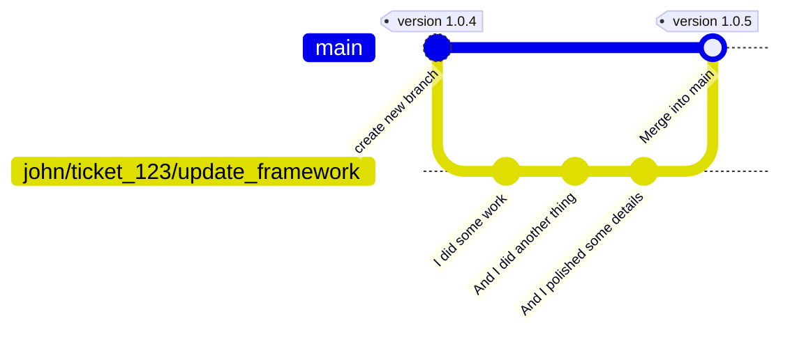
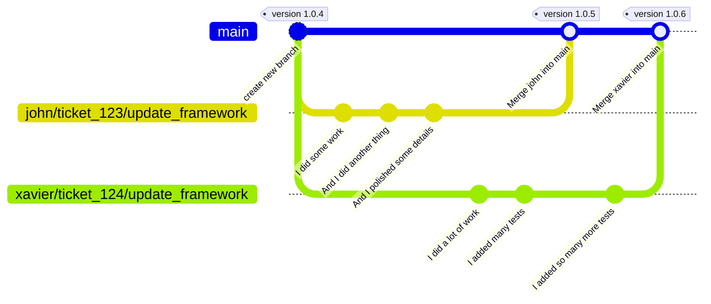
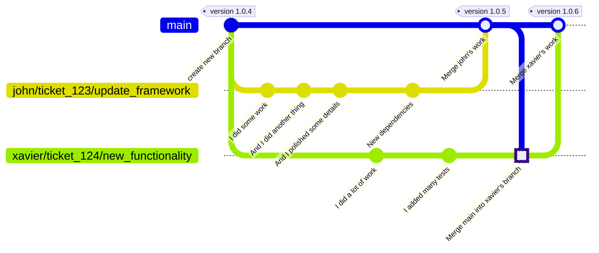
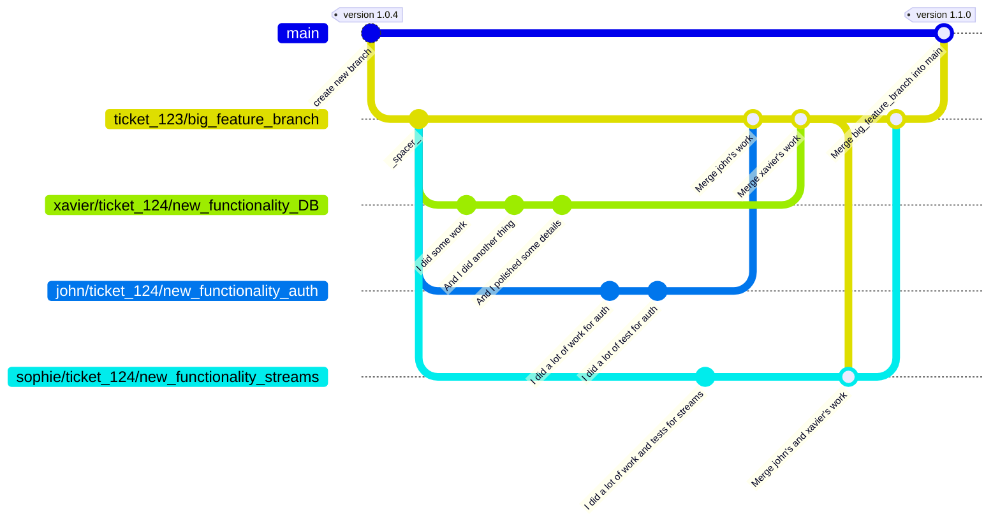
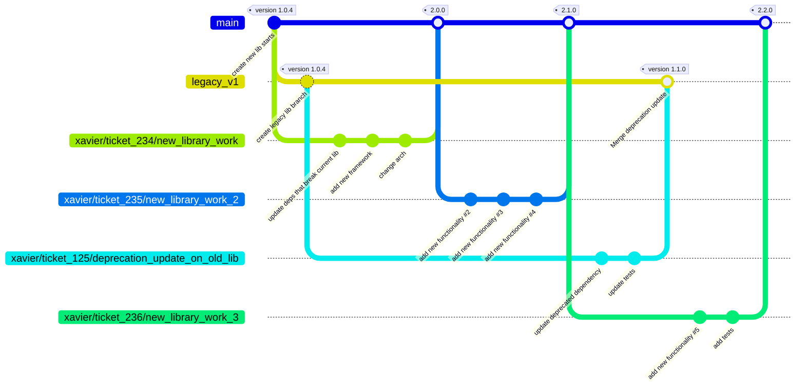

# Git Branching Strategy

So many ways are the right way to do Git branching that it seems that whatever you choose, you choose wrong, or at least one right among the other "n" right
choices.

Whatever choice... it can always be put in perspective and end up being the "wrong" choice for some.

It seems that even language choices are easier to make than Git branching strategies, as every dev will have the "truth" here.

## GitHub flow (momentarily)

### TL/DR:

> In a GitHub Flow strategy, there is a main branch and short-lived branches for whatever work that will be later merged to the main branch.
>
>For a detailed explanation, you can check [GitHub's own documentation](https://docs.github.com/en/get-started/quickstart/github-flow).

### How GitHub Flow is applied at BareMetalCode:

#### High-level view

GitHubFlow is applied by using the main branch as the production-ready code and short-lived branches for feature development, bug fixes, and
other tasks.

Once the work in a branch is completed, the branch is merged back to the main branch, and the feature or bug fix is released to the users.

The above is applied with tweaks as explained below.

## Why

It is a fast strategy, easy to understand and to follow.

Because of the nature of the project, this strategy fits well into the modular independent nature of microservices.

The low overhead of having short-lived "work branches" is a good balance in speed and safety as opposed to having cascading long-lived branches
(prod/stage/test/dev) or direct to trunk approaches.

It allows a quality / safety "gate" to happen on the short-lived branches and avoids the multiple deployment to long-lived environment-based branches approach
or the collection of many features into a single release.

## Disadvantages

GitHub flow is not perfect and is not a good fit for every use case such as large monoliths, projects that require strict release cycles, or software that needs
to track and support several releases concurrently.

Those use cases may be better off with a different flow.

For this application, consisting mainly of microservices, GitHub flow is a good enough fit.

## How

Below is explained from the most common to the most conflicting cases.

### Main branch

> TL/DR:
>
> Work is never done in `main` directly.
>
> The `main` branch is the stable branch, and is automatically deployed to the lower/s environment/s.

`Main` branch is special in the sense that it has to be "always deployable".

This can mean that has to be always "production ready", as in, what is in `main` is in prod, and is deployed almost immediately.
 or...
 It can also mean it is always first-gate / first-env deployable.

I will take the second idea for this flow.

`main` has to be stable enough to deploy to a given first environment without making it unusable.

> Note: "not making it unusable" means that it should not render the environment completely unusable, but it can be in a degraded state, for example, with some
> features disabled, or with some features partially working / broken.

The `main` branch in this flow is not always a synonym for production as it can be ahead of prod by a few commits
 It can be the case of libraries or plugins in which `main` tracks the latest version of two in flight versions, `latest` and `legacy`.

Probably in a future `main` will be a prod mirror for microservices.

---

### Working on main

Early on, maybe `main` is not protected on purpose so direct pushes to `main` may happen.

The rule of thumb scenario is that `main` is protected and only accepts merge requests. (globally configured and non-overrideable)

### Feature branches / Hotfix branches / any non-main branch.

> TL/DR: Any `non-main` branch is where the work happens. They can be (and should always be considered...) unstable.

After branching from `main`, work is done on a feature / hotfix / bug / etc. branch.

Without expanding on ci/cd, there can be a sandbox environment (maybe local) to do "dev work" without affecting other environments with broken code.

Code on `non-main` branches is to be considered unstable / broken / incomplete / degraded / with disabled features / pending / in progress / etc.

### Merge or Rebase?

If working alone in a branch, it is indifferent to merge or rebase. If working with others in a common branch, never rebase, always merge.

### Branch naming conventions

Branch names should be descriptive and follow a consistent pattern.

pattern: `dev_name/ticket_id/brief_description`

Example: `john/ticket_123/update_framework`

> note: this is just a demo pattern that will be dropped eventually.

### Simplest case: One developer works on some feature

1. create a branch from `main`
2. work on the given branch
3. merge the branch back to `main`

### Two developers work on different features with no overlap

1. create a branch from `main` for dev one
2. create a branch from `main` for dev two
3. work on the given branches
4. merge the branches back to `main`

### Two developers work on different features with overlap

This scenario means that the first dev touches a file also touched by the second dev, which will eventually require the second dev to merge the changes before
merging back to `main`.

This scenario can happen if say both devs are adding different features that touch the same database repository, or an API, etc.

It's more common than it seems, for example, when updating a configuration file of some sort. It can be a standard file like a build file, or a custom
configuration when two different features require the addition of some externalized parameter.

1. create a branch from `main` for dev one
2. create a branch from `main` for dev two
3. work on the given branches
4. dev one merges back to `main` which will cause some conflict to work done by dev two
5. dev two merges `main` to the working branch, solves conflicts, and merges back to `main`

### Many developers work on a single common feature in parallel with some overlap

This scenario means that more than one dev works on a complex feature at the same time that does not make sense to merge to main until all work is done.

This scenario is either theoretical or a complex feature.
 It means a feature can be broken down to make work manageable, but it cannot be released to main without the full work done, or it makes sense to have a
single point in time for rollback.

Real life is messy, so this scenario will eventually happen. Very unlikely, but it will happen.

1. create a branch from `main` as `big_feature_branch`
2. create a branch from `big_feature_branch` for dev one
3. create a branch from `big_feature_branch` for dev two
4. create a branch from `big_feature_branch` for dev three
5. work on the given branches
6. dev one merges back to `big_feature_branch`
7. dev two merges back to `big_feature_branch`
8. dev three wants to merge back to `big_feature_branch` but there are some conflicts
    1. merges the feature branch with the rest of the dev's work
9. dev three merges back to `big_feature_branch`
10. dev one (or anyone) merges the `big_feature_branch` back to `main`

_**spacer**_ is not a commit, just to make the graph clearer by adding some space to allow rendering space on some tools.

### Regarding libraries / plugins

Libraries, plugins, etc. are not like microservices as they are most likely self-contained and may require more than a version to exist at the same time.
 This happens as a library can be a deep dependency, and this approach adds some flexibility for adoption.

This previous scenario fits almost ok for a library.

The tweak he is that `main` tracks the new library and an `old_version_branch` tracks the legacy one until full adoption.

If there is a requirement for the old version like a deprecated dependency update or vulnerability while the new lib is not yet ready or has not been completely
adopted, said updated can be applied to the `old_version_branch` branch.

> Having more than two productive branches in flight is a **no-no** and may flag a design problem.

The idea of the project is to always update to whatever is latest, so this case may never happen, but real life is messy, so at some point it will happen...

### Problems:

Safety gates are to be put in place, so merging to `main` cannot be done without passing the gates.

Without getting too much into the safety gates, we can at least mention that testing suites, testing thresholds, static code analysis tools, multiple
environments, etc., will work to mitigate problems as much as human and machine possible.

Problems will still arise regardless of any amount of mitigation effort.

## What's Next

CI/CD should go next

## References

- [GitHub flow documentation](https://docs.github.com/en/get-started/quickstart/github-flow)
- [Git documentation](https://git-scm.com/docs)