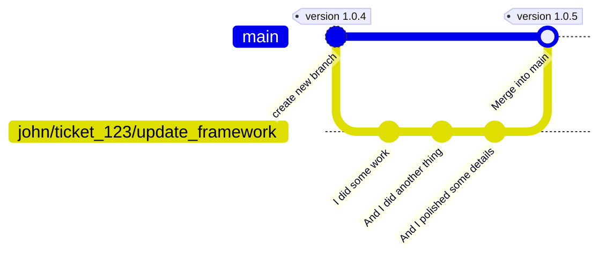
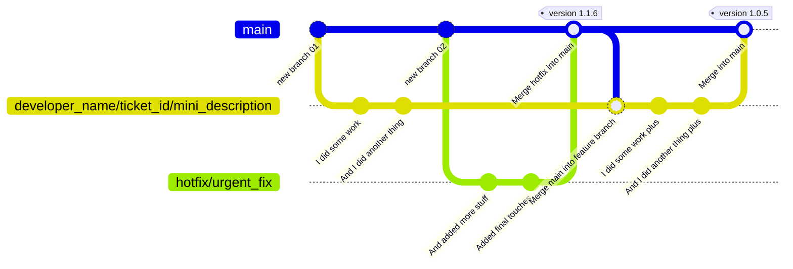

# Git Branching Strategy

So many ways are the right way to do Git branching that it seems that whatever you choose, you choose wrong, or at least one right among the other "n" right
choices.

Whatever choice... it can always be put in perspective and end up being the "wrong" choice for some.

It seems that even language choices are easier to make than Git branching strategies, as every dev will have the "truth" here.

## GitHub flow (momentarily)

### TL/DR:

In a GitHub Flow strategy, there is a main branch and short-lived branches for whatever work that will be later merged to the main branch.

For a detailed explanation, you can check GitHub's own documentation: [GitHub flow documentation](https://docs.github.com/en/get-started/quickstart/github-flow)

### How GitHubFlow is applied at BareMetalCode:

#### High-level view

GitHubFlow is applied by using the main branch as the production-ready code and short-lived branches for feature development, bug fixes, and
other tasks.

Once the work in a branch is completed, the branch is merged back to the main branch, and the feature or bug fix is released to the users.

## Why

It is a fast strategy, easy to understand and to follow.

Because of the nature of the project, this strategy fits well into the modular independent nature of microservices.

The low overhead of having short-lived "work branches" is a good balance in speed and safety as opposed to having cascading long-lived branches
(prod/stage/test/dev) or direct to trunk approaches.

It allows a quality / safety "gate" to happen on the short-lived branches and avoids the multiple deployment to long-lived environment-based branches approach.

## How

Below are explained the most common to the most conflicting cases.

### Simplest case: One developer works on some feature

1. create a branch from `main`
2. work on the given branch
3. merge the branch back to `main`

### Simplest case: One developer works on some feature

1. create a branch from `main`
2. work on the given branch
3. merge the branch back to `main`

## What's Next

## References

- [GitHub flow documentation](https://docs.github.com/en/get-started/quickstart/github-flow)