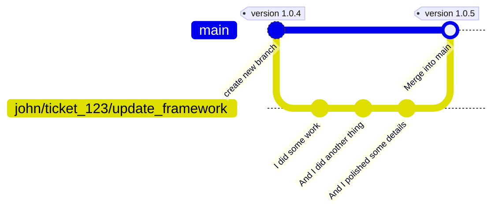
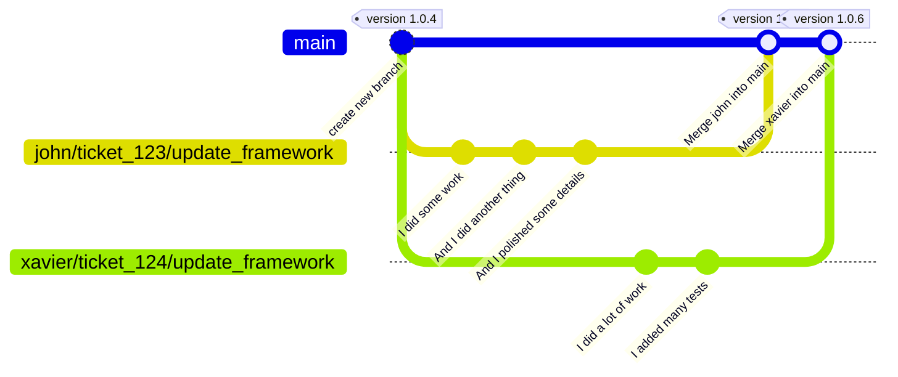
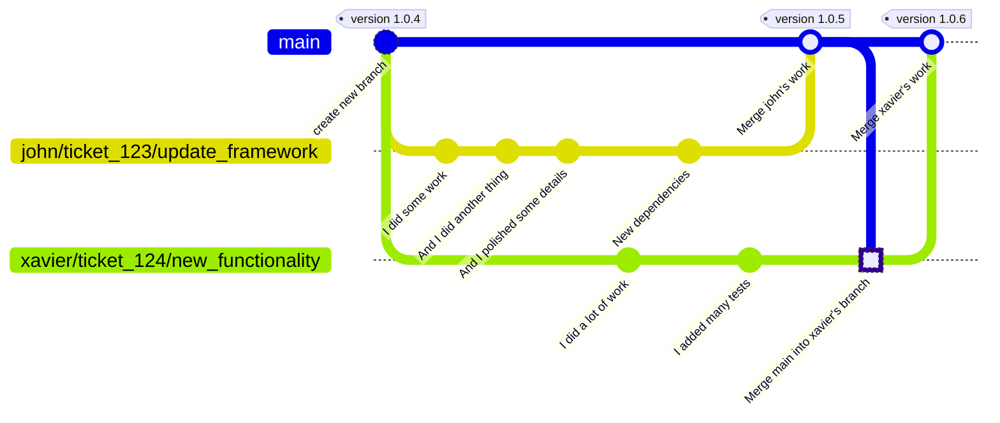
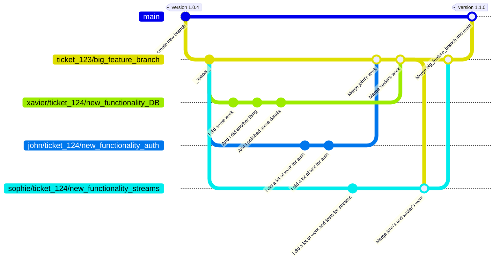

# Git Branching Strategy

So many ways are the right way to do Git branching that it seems that whatever you choose, you choose wrong, or at least one right among the other "n" right
choices.

Whatever choice... it can always be put in perspective and end up being the "wrong" choice for some.

It seems that even language choices are easier to make than Git branching strategies, as every dev will have the "truth" here.

## GitHub flow (momentarily)

### TL/DR:

In a GitHub Flow strategy, there is a main branch and short-lived branches for whatever work that will be later merged to the main branch.

For a detailed explanation, you can check GitHub's own documentation: [GitHub flow documentation](https://docs.github.com/en/get-started/quickstart/github-flow)

### How GitHubFlow is applied at BareMetalCode:

#### High-level view

GitHubFlow is applied by using the main branch as the production-ready code and short-lived branches for feature development, bug fixes, and
other tasks.

Once the work in a branch is completed, the branch is merged back to the main branch, and the feature or bug fix is released to the users.

## Why

It is a fast strategy, easy to understand and to follow.

Because of the nature of the project, this strategy fits well into the modular independent nature of microservices.

The low overhead of having short-lived "work branches" is a good balance in speed and safety as opposed to having cascading long-lived branches
(prod/stage/test/dev) or direct to trunk approaches.

It allows a quality / safety "gate" to happen on the short-lived branches and avoids the multiple deployment to long-lived environment-based branches approach.

## How

Below are explained the most common to the most conflicting cases.

### Working on main

Early on maybe main is not protected on purpose so accidental direct pushes to `main` may happen.

The rule of thumb scenario is that `main` is protected and only accepts merge requests. (globally configured and non-overrideable)

### Merge or Rebase?

If working alone in a branch, it is indifferent to merge or rebase. If working with others in a common branch, never rebase, always merge.

### Simplest case: One developer works on some feature

1. create a branch from `main`
2. work on the given branch
3. merge the branch back to `main`

### Two developers work on different features with no overlap

1. create a branch from `main` for dev one
2. create a branch from `main` for dev two
3. work on the given branches
4. merge the branches back to `main`

### Two developers work on different features with overlap

This scenario means that the first dev touches a file also touched by the second dev, which will eventually require the second dev to merge the changes before
merging back to `main`.

1. create a branch from `main` for dev one
2. create a branch from `main` for dev two
3. work on the given branches
4. dev one merges back to `main` which will cause some conflict to work done by dev twow

### Many developers work on a single common feature in parallel with some overlap

This scenario means that more than one dev works on a complex feature at the same time that does not make sense to merge to main until all work is done.

This scenario is either theoretical or a complex feature.
 It means a feature can be broken down to make work manageable, but it cannot be released to main without the full work done, or it makes sense to have a
single point in time for rollback.

Real life is messy, so this scenario will eventually happen. Very unlikely, but it will happen.

1. create a branch from `main` as `big_feature_branch`
2. create a branch from `big_feature_branch` for dev one
3. create a branch from `big_feature_branch` for dev two
4. create a branch from `big_feature_branch` for dev three
5. work on the given branches
6. dev one merges back to `big_feature_branch`
7. dev two merges back to `big_feature_branch`
8. dev three wants to merge back to `big_feature_branch` back there are some conflicts
    1. merges the feature branch with the rest of the dev's work
9. dev three merges back to `big_feature_branch`
10. dev one (or anyone) merges the `big_feature_branch` back to `main`

_**spacer**_ is not a commit, just to make the graph clearer by adding some space to allow rendering space on some tools.

## What's Next

## References

- [GitHub flow documentation](https://docs.github.com/en/get-started/quickstart/github-flow)