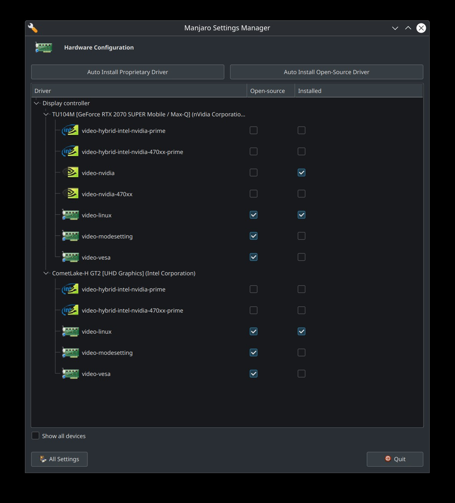
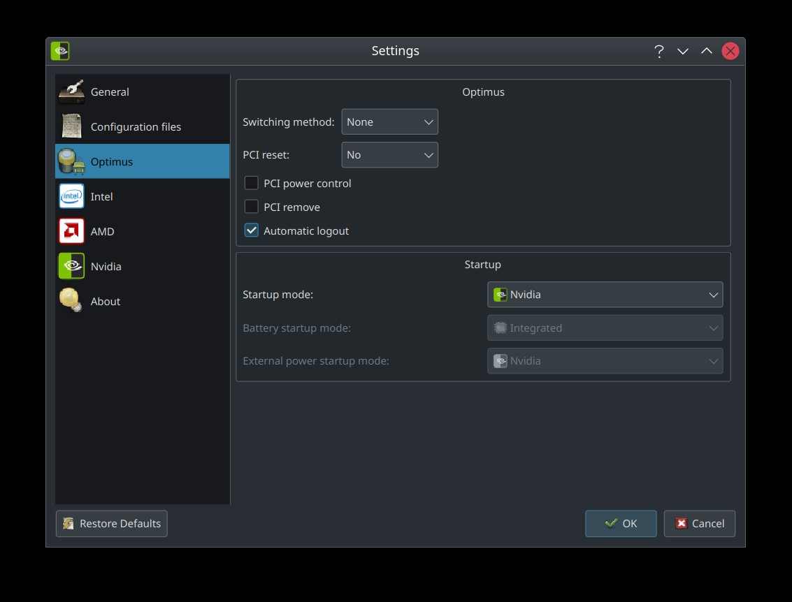
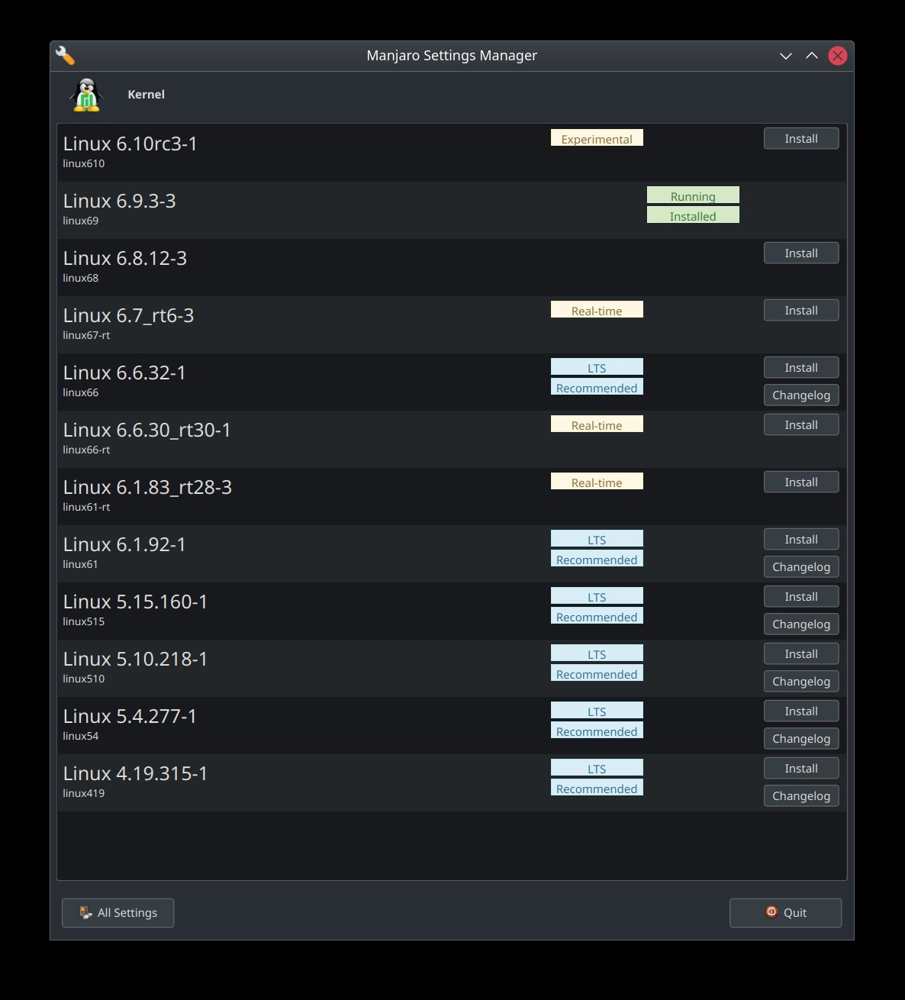

## ArchFamily of Linux OS configs and tweaks:

### Graphics for nvidia powered laptops

#### Windowing systems

For some time now [Wayland](https://wayland.freedesktop.org/) is being recommended more and more,
and with the latest iteration of [KDE](https://kde.org/) (6), it's taking center stage.<br>

Having said that, I found with nvidia and also with intel only powered laptops,
Wayland has all sorts of performance issues connecting multiple monitors.

Avoid Wayland or revert to Xorg if you run into problems with a config as described above.

#### Drivers

> Note:<br>
> The below is not Wayland compatible, a workaround is to follow the steps below on Xorg then switch to Wayland

- On Manjaro settings Manager, install nvidia and video-linux drivers only.
  
- install optimus + optimus-plasma
- to switch graphs, we need to offload first, and then restart

```zsh
prime-offload && optimus-manager --switch nvidia
```

`prime-offload` will need to be pre-run if you want to launch some utils like the optimus-manager widget.



You can configure defaults and other settings for an nvidia gpu powered laptop from the widget.

### Kernel

Always install the **latest** stable kernel.<br>
As your systems ages, you may want to leave an `LTS kernel` installed for recovery or troubleshooting purposes.



Do not run your system on experimental kernels.

### Tools:

#### General:

You can install these tools all at once with the below command:

```zsh
sudo pacman -S brave-browser gimp code
```

- brave-browser (chrome-based privacy-oriented browser)
- gimp (image editor)
- code-OSS (visual studio code open source)

**Do not log out nor restart, continue to the next section**

#### Dev:

You can install most of these tools all at once with the below command:

```zsh
sudo pacman -S base-devel git jdk-openjdk openjdk-doc openjdk-src maven docker docker-compose kubectl minikube neovim fzf nvm ruby python 
```

- base-devel
- git
- java
    - OpenJDK. Always use the latest.
    - OpenJDK source
    - OpenJDK documentation
    - To switch among many installed ones:
  ```zsh
      archlinux-java status
     ```
    - To select a version:
  ```zsh
      sudo archlinux-java set java-XX-openjdk
     ```
- maven
- docker
    - configure your docker installation to use **your user** instead of **root**:
  ```zsh
   sudo usermod -a -G docker $USER
  ``` 
- docker-compose
- kubectl
- minikube
- neovim
- fzf:
    - docs: https://github.com/junegunn/fzf
- nvm (node version manager)
    - docs: https://github.com/nvm-sh/nvm
    - add the following to your `.zshrc` file, save the file then close all terminals
  ```text
  source /usr/share/nvm/init-nvm.sh 
  ```
    - in a new terminal, install `Node.js`. Always use the latest
    ```zsh
     nvm install node --default --latest-npm
  ```
- ruby
- python

**Do not log out nor restart, continue to the next section**

#### DBs

- PostgreSQL
    - [setup postgresql in manjaro](https://dev.to/tusharsadhwani/how-to-setup-postgresql-on-manjaro-linux-arch-412l)
- MariaDB
    - [setup mariadb in manjaro](https://idroot.us/install-mariadb-manjaro-21/)

**After installing _-and-_ configuring the databases, restart the computer (probably logging out will do just fine)**

### Tweaks

### useful shell alias:

These are some useful alias of my personal preferences. Add more here if you fancy explaining what they do / how they help.

In the `.zshrc` file add the following:

```text
alias pac-installed='pacman -Qq | fzf --preview '\''pacman -Qil {}'\'' --layout=reverse --bind '\''enter:execute(pacman -Qil {} | less)'\'''
alias pac-list='pacman -Slq | fzf --preview '\''pacman -Si {}'\'' --layout=reverse'
alias ll='ls -lah'
```

- The command `pac-installed` will show a list of all packages installed
- The command `pac-list` will show a list of all packages in pacman's remote repositories
- The command `ll` will list a directory with extended info displaying sizes in human-readable format

Close all your terminals or execute the below command on the ones open to apply the changes:

```zsh
 source .zshrc
  ```

####              