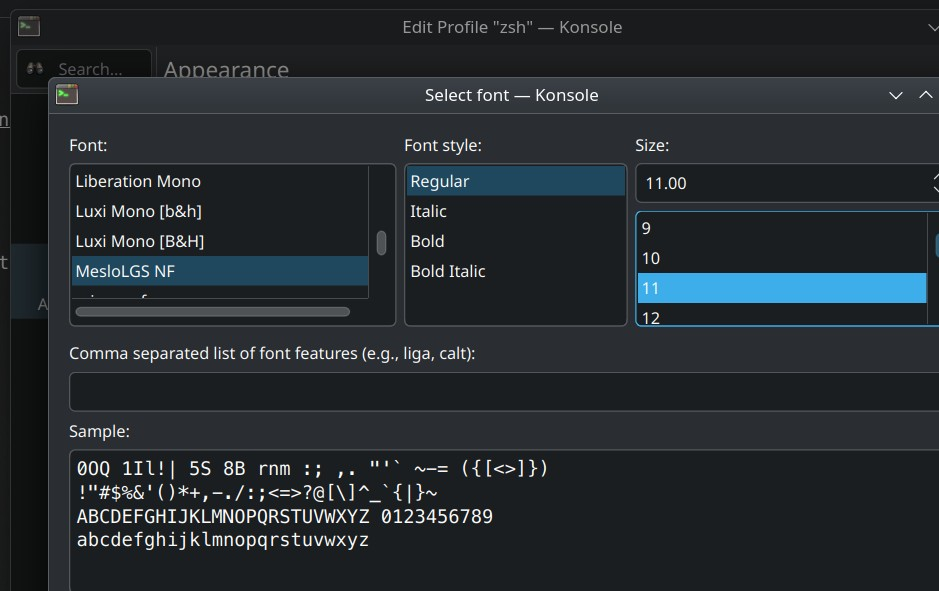

## OpenSuSE of Linux OS configs and tweaks:

These instructions work on [OpenSuSE](https://www.opensuse.org/) Tumbleweed. They will probably work on other OpenSuSE / SuSE OSs
flavours.<br>
[OpenSuSE Tumbleweed](https://en.opensuse.org/Portal:Tumbleweed) being very on the bleeding edge

### OpenSuSE Tumbleweed: the rolling distro

This is just a preference choice and by no means a recommendation. Rolling / on-the-bleeding-"edgy" distributions are fun but have some
quirks as it can be expected.<br>
The team at OpenSuSE seems to do a great job, but it is not a question of _**if**_ something is going to break but actually
_**when**_...

Use this distro only if you are comfortable navigating some occasional hiccups.

### Kernel

Tumbleweed is usually a few days behind the stable or mainline [Linux kernel](https://kernel.org/).<br>
It is not as easy to control which kernel to lock or how many to keep as a backup in case something goes wrong.

If the sentences above don't make a lot of sense, maybe choose [Manjaro](ArchFamily.md) as a solid rolling distro with a few more
friendly-er settings.

### Tools:

install the missing library for intelliJ not to fail

```zsh
sudo zypper in libgthread-2_0-0
```

### Java JDKs

#### Dev:

You can install most of these tools all at once with the below command:

```zsh
sudo zypper in git gcc 
```

- base-devel
- git
- java
    - OpenJDK. Always use the latest.
    - OpenJDK source
    - OpenJDK documentation
    - To switch among many installed ones:
  ```zsh
      archlinux-java status
     ```
    - To select a version:
  ```zsh
      sudo archlinux-java set java-XX-openjdk
     ```
- maven
- docker
    - configure your docker installation to use **your user** instead of **root**:
  ```zsh
   sudo usermod -a -G docker $USER
  ``` 
- docker-compose
- kubectl
- minikube
- neovim
- fzf:
    - docs: https://github.com/junegunn/fzf
- nvm (node version manager)
    - docs: https://github.com/nvm-sh/nvm
    - add the following to your `.zshrc` file, save the file then close all terminals
  ```shell
  source /usr/share/nvm/init-nvm.sh 
  ```
    - in a new terminal, install `Node.js`. Always use the latest
    ```zsh
     nvm install node --default --latest-npm
  ```
- ruby
    - to avoid using `sudo` we need to configure a `GEM_PATH` that is local to the user, and also configure `bundler`
      to use that path to install gems:
    ```shell
  ```
    - install ruby-json as it is not installed by default in archFamily
    ```shell
    sudo pacman -S ruby-json
  ```
- python

**Do not log out nor restart, continue to the next section**

#### DBs

```zsh
sudo pacman -S postgresql postgresql-docs mariadb
```

- PostgreSQL
    - [setup postgresql in manjaro](https://dev.to/tusharsadhwani/how-to-setup-postgresql-on-manjaro-linux-arch-412l)
- MariaDB
    - [setup mariadb in manjaro](https://idroot.us/install-mariadb-manjaro-21/)

**After installing _-and-_ configuring the databases, restart the computer (probably logging out will do just fine)**

#### moving to zsh from bash:

If you like [bash](https://www.gnu.org/software/bash/), then ignore this section.

Somehow, [zsh](https://en.wikipedia.org/wiki/Z_shell) grew on me, so below are the steps to install zsh on OpenSuSE for your own user.<br>
You could follow all this zsh instructions for `root` too, but because how OpenSuSE is wired, I don't recommend you do... you may not get
fully rid of bash safely is that's your wish.

```bash
sudo zypper in zsh bluez-zsh-completion bubblewrap-zsh-completion cnf-zsh docker-zsh-completion dolphin-zsh-completion firewalld-zsh-completion \
  flatpak-zsh-completion helm-zsh-completion konsole-zsh-completion nvimpager-zsh-completion nvme-cli-zsh-completion powerprofilesctl-zsh-completion \
  ripgrep-zsh-completion udisks2-zsh-completion wireplumber-zsh-completion wl-clipboard-zsh-completion
  
# wait for installation to complete and set it as default shell for your user.
chsh -s $(which zsh)
```

Close all terminals or logout / login for changes to apply.
Once you open a terminal again, `zsh` will be your shell

Let's add some bling:

- [OhMyZsh](https://ohmyz.sh/)
- [Autosuggestions](https://github.com/zsh-users/zsh-autosuggestions)
- [Syntax highlighting](https://github.com/zsh-users/zsh-syntax-highlighting)
- [PowerLevel10k](https://github.com/romkatv/powerlevel10k)

```zsh
sh -c "$(curl -fsSL https://raw.githubusercontent.com/ohmyzsh/ohmyzsh/master/tools/install.sh)"

git clone https://github.com/zsh-users/zsh-autosuggestions ${ZSH_CUSTOM:-~/.oh-my-zsh/custom}/plugins/zsh-autosuggestions

git clone https://github.com/zsh-users/zsh-syntax-highlighting.git ${ZSH_CUSTOM:-~/.oh-my-zsh/custom}/plugins/zsh-syntax-highlighting

git clone --depth=1 https://github.com/romkatv/powerlevel10k.git ${ZSH_CUSTOM:-$HOME/.oh-my-zsh/custom}/themes/powerlevel10k
```

The last step will run the **p10k** configurer, it nothing happens, run it manually like below

```zsh
p10k configure
```

Let's use **powerlevel10k** as **OhMyZsh** THEME

```zsh
vim ~/.zshrc
# change the theme -> locate the line with ZSH_THEME and replace it like below 
# ZSH_THEME="powerlevel10k/powerlevel10k"
```

If you have problems with fonts, like not seeing a few icons during setup, follow these instructions to add patched fonts:

- [PowerLevel fonts](https://github.com/romkatv/powerlevel10k?tab=readme-ov-file#fonts)

add the fonts to the fonts folder then add them to the system fonts

After zsh and its companions are installed, set the font on a konsole profile so all looks as intended. In my case, it's **MesloGS NF**:


### Tweaks

### useful shell aliases:

> **Note**: listing here all customizations and configurations added to different config files

These are some useful alias of my personal preferences.<br>
Add more here if you fancy explaining what they do / how they help.

In the `.zshrc` file add the following :

```shell
# customization


## nvm config
export NVM_DIR="$HOME/.nvm"
[ -s "$NVM_DIR/nvm.sh" ] && \. "$NVM_DIR/nvm.sh"  # This loads nvm
[ -s "$NVM_DIR/bash_completion" ] && \. "$NVM_DIR/bash_completion"  # This loads nvm bash_completion

## ruby gem config, this will allow to install gems in our own directory instead of default installation one, avoiding to use sudo. 
export GEM_HOME=$HOME/.gem
export PATH="$GEM_HOME/bin:$PATH"

```

- Config:
    - nvm:
        - initialize nvm to manage different Node.js versions
    - ruby:
        - create a `GEM_HOME` local to the user
        - add the exec path of gems to the path

Close all your terminals or execute the below command on the ones open to apply the changes:

```zsh
 source ~/.zshrc
  ```

####                           